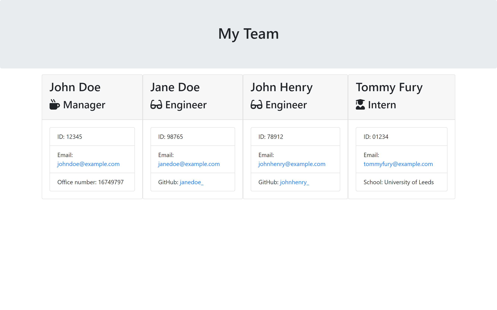

 

  <h1 align="center">Team Profile Generator</h1>
  

    A command-line application that dynamically generates a team profile page based on a user's input.
     
    <a href="https://github.com/OsmanTolo/team_profile_generator-javascript-nodeJs">View the source code</a>
  

## About The Project

This repo presents a Node.js command-line application that takes user-fed employee information and generates a static HTML webpage to display a summary of each employee for quick access to their emails and GitHub profiles. The application will run in the users CLI of their integrated development environment (IDE) using [Node.js](https://nodejs.org/en/).

The user is presented with a series of questions using the [Inquirer package](https://www.npmjs.com/package/inquirer), which requires the user to input answers about their team. The answers provided are used to fill in the different fields of the profile cards.

The repo serves as my solution to the Module 12 - Team Profile Generator Challenge of Trilogy Skills Front-End Development Boot Camp.

The project provide evidence of my ability to work with Node packages, node modules and asynchronous functions in JavaScript. The result is an intuitive application that can save time.

## Usage

Visit this github repo [link](https://github.com/OsmanTolo/team_profile_generator-javascript-nodeJs) to access the code. To use it, clone the repository to your local directory and run 'node index.js' in your IDE's CLI window.

## License

Distributed under the MIT License.

## Contact

Osman Dumbuya - [@OsmanTolo\_](https://twitter.com/OsmanTolo_)

Project Link: [https://github.com/OsmanTolo/readme_geenrator-node-js/tree/main](https://github.com/OsmanTolo/team_profile_generator-javascript-nodeJs)

## Acknowledgments

- [Skills for Life](https://skillsforlife.campaign.gov.uk/courses/skills-bootcamps/)
- [Othneil Drew's Best-README-Template](https://github.com/othneildrew/Best-README-Template)
